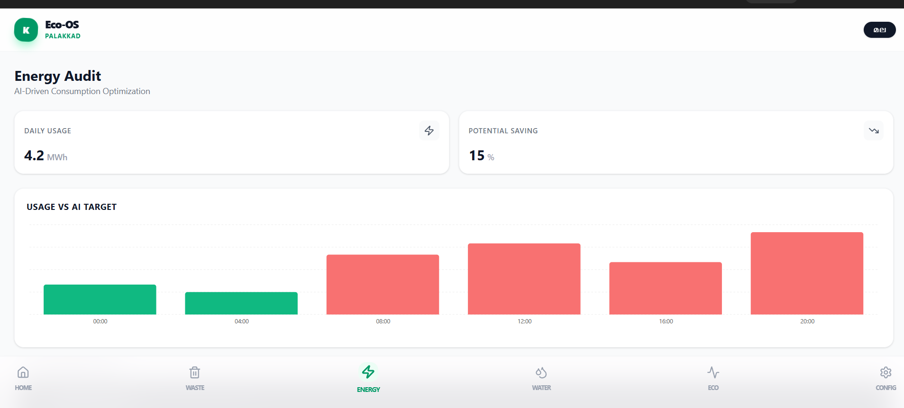
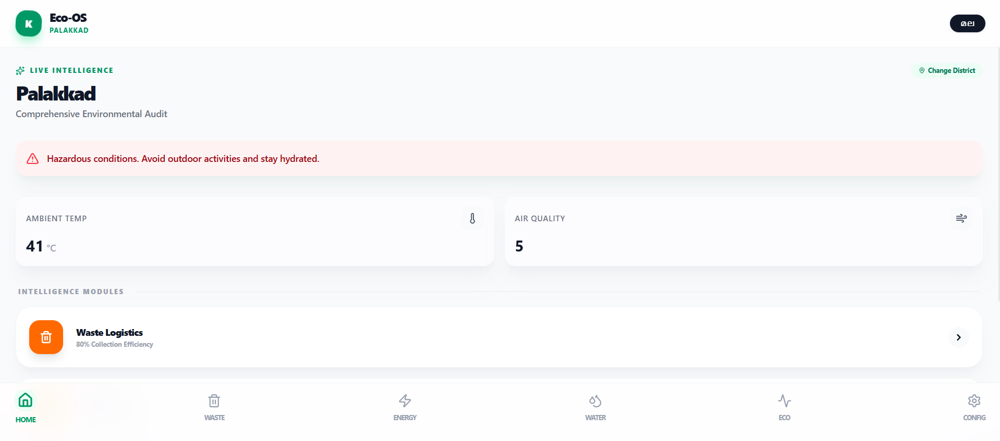
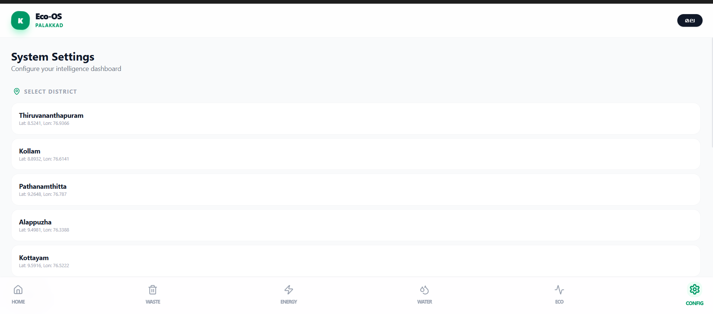

EcoKerala: AI-Driven Sustainable Futures Platform
  
## Problem Statement
Kerala faces critical environmental and infrastructural challenges, including the vulnerability of coastal communities to climate change, inefficient municipal waste routing, high energy consumption, water wastage, and a lack of hyper-local, bilingual environmental data for farmers. There is a need for a centralized, intelligent platform to monitor these factors and provide actionable, localized guidance.

## Project Description
EcoKerala is a modular, native mobile application (built with React Native and Expo) that tackles five core sustainability pillars. It ingests real-time environmental data (Air Quality, Weather, Soil/Water metrics) via OpenWeatherMap and processes it using Google's generative AI to output actionable insights.

Core functionalities include:

Environmental Monitoring: Real-time dashboards tracking air, water, and soil data with localized bilingual alerts (English/Malayalam) for farmers.

Waste Management: AI-driven logic to propose optimized waste collection routes based on urban density and environmental factors.

Energy Optimization: AI-generated recommendations to help households reduce their power footprint.

Smart Water Management: Threshold-based alert systems to detect potential infrastructural leaks and prevent wastage.

Climate Impact Visualizer: Interactive geospatial mapping to visualize climate risks for Kerala's coastal communities.---

## Google AI Usage
### Tools / Models Used
Google Gemini API (Gemini 1.5 Flash / Pro)

### How Google AI Was Used
Google's Gemini API serves as the core intelligence engine of the application. Instead of relying on static, hardcoded thresholds, the app feeds real-time API data (AQI, temperature, humidity, location coordinates) directly to the Gemini model. Gemini dynamically generates highly contextual, hyper-local recommendations for users. Furthermore, Gemini is utilized to instantly translate these complex environmental warnings and agricultural advice into accurate Malayalam, ensuring the app is fully accessible to local farmers and residents.
---

## Proof of Google AI Usage
Attach screenshots in a `/proof` folder:

---

## Screenshots 
Add project screenshots:

  

---

## Demo Video
[Upload your demo video to Google Drive and paste the shareable link here(max 3 minutes).
[Watch Demo](#)](https://drive.google.com/file/d/1vH8GygMdcZMjlyZSGl4MCXbKqrMcaBHi/view?usp=sharing)

---

## Installation Steps

# Clone the repository
git clone <your-repo-link>

# Go to project folder
cd ecokerala-app

# Install dependencies for the Expo project
npm install

# Set up your environment variables
# 1. Create a .env file in the root directory
# 2. Add EXPO_PUBLIC_WEATHER_API_KEY=your_openweathermap_key
# 3. Add EXPO_PUBLIC_GEMINI_API_KEY=your_google_gemini_key

# Run the project locally
npx expo start
